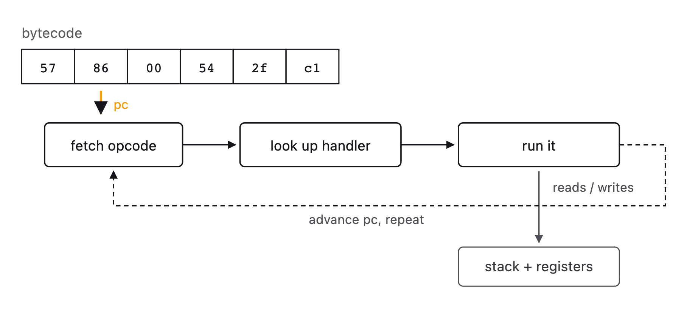
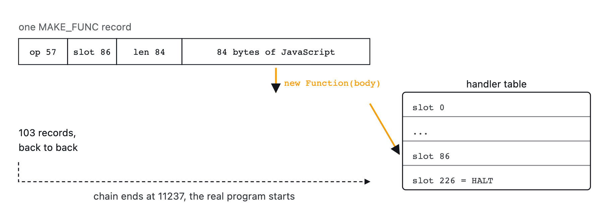
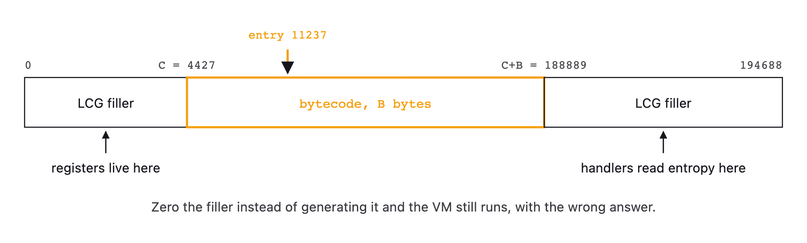
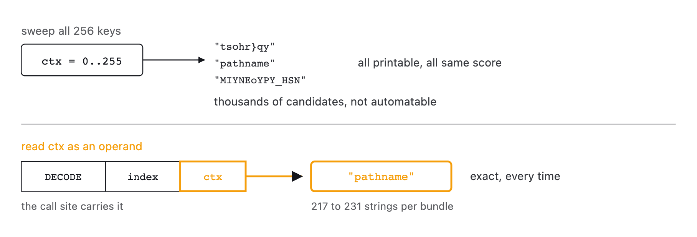

# datadome-plv3-vm-disassembler

<div align="center">
  
  
  
  
  <a href="https://github.com/glizzykingdreko/datadome-plv3-vm-disassembler"></a>
</div>

<div align="center">
  <a href="https://takionapi.tech/blog/datadome-plv3-vm-disassembler"></a>
  <a href="https://github.com/glizzykingdreko/new-datadome-deobfuscator"></a>
  <a href="https://takionapi.tech"></a>
  <a href="https://buymeacoffee.com/glizzykingdreko"></a>
</div>
<br />


Disassembler for DataDome's **plv3 virtual machine**, the one that produces the `plv3` token on the interstitial and the captcha. It recovers the opcode table, the primitive table, the value tags and the string table straight out of the bundle you feed it, then prints a readable listing. No hardcoded offsets, no per-rotation patching.

**Before starting**

DataDome rebuilds these bundles constantly. Identifier names, register offsets, the LCG seed, the value tag bytes, the primitive slot IDs and every opcode byte rotate on each push. This tool never looks up a constant, it derives all of them from the file it is given, which is why the same code handles today's bundle and the one that lands tomorrow morning. Verified against 6 different rotations across both challenge types.

If you want the analysis of how the VM works and how it got taken apart, read [**the full write-up**](https://takionapi.tech/blog/datadome-plv3-vm-disassembler). 

## Table of Contents

- [What it does](#what-it-does)
- [The VM in one minute](#the-vm-in-one-minute)
- [Getting a bundle to feed it](#getting-a-bundle-to-feed-it)
- [Install](#install)
- [CLI usage](#cli-usage)
- [Use it as a node module](#use-it-as-a-node-module)
- [What the listing looks like](#what-the-listing-looks-like)
- [Output shape](#output-shape)
- [How it works](#how-it-works)
- [What rotates and what does not](#what-rotates-and-what-does-not)
- [Captcha versus interstitial](#captcha-versus-interstitial)
- [What the VM reads](#what-the-vm-reads)
- [Project structure](#project-structure)
- [Related work](#related-work)
- [Need DataDome bypass solutions?](#need-datadome-bypass-solutions)
- [Connect with me](#connect-with-me)

## What it does

Point it at a `vm-obf.js` bundle and it gives you:

- **The flat buffer**, rebuilt exactly as the VM sees it, LCG filler included
- **103 opcode handlers**, extracted with their original JavaScript bodies
- **The primitive table**, every slot classified by role (readers, stack ops, property access, string cipher, dispatch)
- **The value tag map**, tag byte to byte width, so operands can actually be skipped correctly
- **A full disassembly**, around 40k instructions per bundle, with mnemonics and resolved jump targets
- **The string table**, decoded exactly, not guessed. Roughly 220 unique strings per bundle
- **The API chains the program evaluates**, reconstructed from the listing: `document.timeline.currentTime`, `navigator.webdriver`, `window.atob.toString`, each with a byte offset
- **The exit contract**, which handler writes the token and what the VM reports back alongside it
- **A summary JSON** you can diff between two rotations to see what actually changed

### How to extract the `vm-obf.js`?

Make sure to check out and use my open source [New-Datadome-Deobfuscator](https://github.com/glizzykingdreko/new-datadome-deobfuscator)

## The VM in one minute

The bundle is a small loader, about 160 lines after deobfuscation. It base64-decodes a ~190 KB payload into a ~200 KB flat buffer, fills everything outside the bytecode window with an xorshift LCG, and starts a dispatch loop.

There is no `switch`. The loop is thread-of-code:

```js
const s = Q[C + Q[D]++], c = g + s;
for (Q[I] = Q[c], Q[4222] = s; !Q[w] && P++ < 1e8;) Q[I]();
```

It reads a byte, uses it as an index into a table of closures, and calls it. Every register lives in the same flat buffer: `Q[4221]` is the program counter, `Q[4158]` is the stack pointer, `Q[4196]` is the halt flag.

<p align="center">
  <picture>
    <source media="(prefers-color-scheme: dark)" srcset="assets/diagrams/dispatch-loop-dark.png">
    
  </picture>
</p>

The interesting part is where those closures come from. The first ~11 KB of bytecode is not code, it is **103 back-to-back MAKE_FUNC records**, each one carrying the plaintext JavaScript source of one opcode:

```
[ 1B MAKE_FUNC opcode ][ 1B target slot ][ 3B big-endian length ][ N bytes of JS source ]
```

The installer runs `new Function(source)`, binds the primitive table into it as `arguments[0]`, and stores the closure. So **the opcode table ships inside the payload and is different in every bundle**. That is the whole trick, and it is also why a disassembler for this thing has to build its instruction set at runtime instead of shipping one.

<p align="center">
  <picture>
    <source media="(prefers-color-scheme: dark)" srcset="assets/diagrams/handler-install-dark.png">
    
  </picture>
</p>

## Getting a bundle to feed it

This tool takes `vm-obf.js`, the VM module out of a DataDome challenge. It does
not fetch or unpack challenges itself, that is a different job and I already
published the tool for it:

**[new-datadome-deobfuscator](https://github.com/glizzykingdreko/new-datadome-deobfuscator)**

Run a challenge page through it and it splits the bundle into its modules.
`vm-obf.js` is the one you want here:

```bash
# 1. deobfuscate the challenge, you get a folder of modules
node new-datadome-deobfuscator/main.js challenge.js out/

# 2. point this tool at the VM module
node bin/ddvm.js out/vm-obf.js
```

Both challenge types work, the interstitial and the captcha ship the same VM.

### Sample bundles

Drop bundles in `samples/` and they stay out of git. That folder is in
`.gitignore` on purpose, DataDome's code is not mine to redistribute, so you
bring your own:

```bash
node bin/ddvm.js samples/interstitial-6add532.vm-obf.js --summary-only
node bin/ddvm.js samples/captcha-8f2566b.vm-obf.js --summary-only
```

For reference, here is what those two print, so you can tell whether your setup
is working before you trust anything else it says:

```
# interstitial 6add532
buffer      194688 bytes, code at 4427..188889
lcg seed    230201374
make_func   opcode 160, 103 handlers, program starts at 11237
primitives  23 slots
readers     u8=22 u16=47 u24=33 typed=17 next=35
value tags  9 (small-int mask 128)
disassembly 39796 instructions, 91.1% of the program, 0 problem(s)
exit        HALT at slot 226, plv3 token -> out.r, loader adds {i, t}

# captcha 8f2566b
buffer      194427 bytes, code at 4341..188521
lcg seed    2015950352
make_func   opcode 206, 103 handlers, program starts at 11303
primitives  23 slots
readers     u8=50 u16=28 u24=14 typed=1 next=46
value tags  9 (small-int mask 128)
disassembly 39594 instructions, 91.3% of the program, 0 problem(s)
exit        HALT at slot 248, plv3 token -> out.r, loader adds {i, t}
```

Different buffer sizes, different MAKE_FUNC opcodes, different HALT slots, same
103 handlers and same 23 primitives. That is the whole point of the tool, every
number on the left rotates and every number on the right does not.

## Install

```bash
git clone https://github.com/glizzykingdreko/datadome-plv3-vm-disassembler
cd datadome-plv3-vm-disassembler
```

Zero dependencies, plain Node 16+. Nothing to install.

## CLI usage

```bash
# print the listing
node bin/ddvm.js samples/interstitial-6add532.vm-obf.js

# just the shape of the bundle
node bin/ddvm.js samples/interstitial-6add532.vm-obf.js --summary-only

# write everything to a folder
node bin/ddvm.js samples/interstitial-6add532.vm-obf.js out/ --strings

# inline each handler's JavaScript under its instruction
node bin/ddvm.js samples/interstitial-6add532.vm-obf.js out/ --source
```

Flags:

| flag | meaning |
|---|---|
| `--source` | print each handler's original JS under every instruction that uses it |
| `--strings` | resolve the string table and write `strings.json` |
| `--chains` | reconstruct the API chains the program evaluates, write `chains.json` |
| `--limit <n>` | stop after n decoded instructions |
| `--summary-only` | print the bundle shape, skip the listing |
| `--json` | print the summary as JSON on stdout |
| `-h`, `--help` | usage |

Exit codes: `0` clean, `1` bad input, `2` the bundle could not be parsed as a plv3 VM.

`--summary-only` on a current interstitial:

```
buffer      209725 bytes, code at 4624..203734
lcg seed    2078235825
make_func   opcode 57, 103 handlers, program starts at 11405
primitives  23 slots
readers     u8=14 u16=45 u24=49 typed=43 next=17
value tags  9 (small-int mask 128)
disassembly 43215 instructions, 90.4% of the program, 0 problem(s)
exit        HALT at slot 165, plv3 token -> out.r, loader adds {i, t}
```

That last line is worth reading twice. Exactly one handler per bundle writes to the output object: it copies the accumulator into `out.r` and raises the halt flag, and that value is the **plv3 token** that goes on the wire. Everything else the VM returns (`i`, `t`, `u`, `e`) is telemetry the loader attaches afterwards, and it all ends up in signals. See [the article](https://takionapi.tech/blog/datadome-plv3-vm-disassembler#how-the-token-gets-out).

## Use it as a node module

```js
const { analyzeFile } = require('./src/index');

const vm = analyzeFile('vm-obf.js');

// the recovered instruction set
for (const op of vm.table.values()) {
  console.log(op.slotId, op.mnemonic, op.operands.map((o) => o.role));
}

// the listing, strings annotated inline
console.log(vm.listing());

// every string the program decodes, with the exact ctx byte per call site
for (const s of vm.stringTable()) {
  console.log(s.hits, JSON.stringify(s.text));
}

// the JavaScript the program actually evaluates, with byte offsets
for (const chain of vm.apiChains()) {
  console.log(chain.hits, chain.calls ? '()' : '', chain.path, '@pc', chain.pcs[0]);
}

// which handler produces the token, and what the VM reports next to it
console.log(vm.exitContract());

// machine-readable shape, handy to diff two rotations
console.log(vm.summary());
```

`analyzeBundle(sourceString)` is there too if you already have the file in memory.

## What the listing looks like

This is real output from the current interstitial bundle. Strings are decoded and attached as comments, so the fingerprinting logic just reads off the page:

```
   35189  138  PUSH_STR       0, 13, 87   ; "Date"
   35195  101  GET_PROP
   35196  138  PUSH_STR       0, 102, 159   ; "now"
   35202  101  GET_PROP
   35203  148  CALL_APPLY
   35204  157  CALL           0
   35210   65  PUSH
   35211  138  PUSH_STR       0, 214, 73   ; "Math"
   35217  101  GET_PROP
   35226  138  PUSH_STR       0, 63, 235   ; "random"
   35232  101  GET_PROP
   35233  148  CALL_APPLY
   35234  157  CALL           0
   35236  118  PUSH_CONST     f64
   35246   24  MUL
   35305  206  JMP_IF_FALSE   26   ; -> 35335
   35310  138  PUSH_STR       0, 196, 251   ; "document"
   35316  101  GET_PROP
   35317  138  PUSH_STR       0, 225, 93   ; "timeline"
   35323  101  GET_PROP
   35324  138  PUSH_STR       0, 264, 252   ; "currentTime"
   35330  101  GET_PROP
```

That is `Date.now()`, `Math.random()` and `document.timeline.currentTime`, recovered statically out of an obfuscated VM.

## Output shape

With an output folder you get:

| file | contents |
|---|---|
| `disasm.txt` | the listing, one instruction per line, jump targets and strings annotated |
| `opcodes.json` | the recovered instruction set: slot id, install order, mnemonic, operand signature, original source |
| `handlers/` | one `.js` file per opcode, named `NNN_slotID_MNEMONIC.js` |
| `summary.json` | buffer geometry, LCG seed, primitives by role, tag map, mnemonic histogram, exit contract, warnings |
| `strings.json` | `unique` (deduplicated) and `sites` (every call site with its pc, table id and ctx) |
| `chains.json` | `chains` (property chains with hit counts, call counts and pcs) and `surface` (strings bucketed by what they probe) |

## How it works

1. **Anchor on the loader.** The only `charCodeAt` in the file sits inside the `Array.from` that builds the flat buffer, and its arrow body spells out the code window as `i >= CODE && i < CODE + LEN`. Buffer size, code base and code length come from that single expression. The LCG seed comes from the assignment above the xorshift trio.
2. **Rebuild the buffer.** Base64 decode, paste the bytecode at its offset, fill everything else with the LCG. The filler matters: registers live below the bytecode and handlers read entropy from above it.
3. **Recover the primitives.** Find the initializer (the only function containing `new Function`), read every `table[idx] = value`, classify each by shape. This is where the byte widths come from: which slot is the u8 reader, which is u16, u24, and which one decodes a tagged value.
4. **Recover the value tags.** The tagged-value reader is a switch whose signed-integer arms are a deliberate fall-through chain, so the widths are derivable without knowing a single tag byte: the terminal arm reads one payload byte, the one above it reads two, and so on.
5. **Walk the MAKE_FUNC chain.** 103 records, each yielding a slot id and a JavaScript body. When a record stops looking like source code, the chain is over and the next byte is the first real instruction.
6. **Build the opcode table.** For each handler, the ordered list of reader-primitive calls is the operand signature. A reader called inside a `for` loop is an inline payload whose length came from the operand read just before it. The mnemonic is pattern matched off the body shape.
7. **Walk the program.** A worklist starting at the entry point, following branches, decoding each address once. Unconditional jumps end a basic block. Anything unreachable is reported as a gap rather than swept over, because a wrong instruction is worse than a missing one.
8. **Resolve the strings.** Covered below, it is the part I like most.
9. **Find the exit.** The loader hands the guest an output object through the primitive table, so one handler can write the finished token onto it. That handler is the VM's `HALT`, and locating it tells you where the token comes from and which of the returned fields are telemetry instead.


<p align="center">
  <picture>
    <source media="(prefers-color-scheme: dark)" srcset="assets/diagrams/buffer-layout-dark.png">
    
  </picture>
</p>

### The string trick

Strings are XOR'd with a keystream `k[i] = (baseKey ^ ctx ^ (i + 1)) & 0xff`. The `ctx` byte is not stored anywhere, which normally means you sweep all 256 values per entry and keep whatever looks readable. That produces a pile of plausible garbage, since XOR against a wrong key lands in printable ASCII most of the time.

It turns out `ctx` is simply an operand. The handler that decodes strings reads a register index, a table id and a ctx byte from the instruction stream, then calls the cipher with all three:

```js
var n = a[45](), r = a[45](), s = a[14]();
var t = a[32][a[11] + n];
a[32][a[32][a[36]]++] = a[23](t, r, s);
```

So once the program is disassembled, **every `PUSH_STR` instruction carries the exact table id and the exact ctx for that call site**. No sweeping, no guessing. The tool maps the cipher call's argument names back to the order the operands were read in, which keeps it working when the rotation reshuffles them.

<p align="center">
  <picture>
    <source media="(prefers-color-scheme: dark)" srcset="assets/diagrams/string-ctx-operand-dark.png">
    
  </picture>
</p>

The string image is not the bytecode either. The prologue pushes it as an inline byte blob, so the disassembly has to exist before the strings can be found. Nice little chicken and egg.

## What rotates and what does not

Everything below was measured across 6 bundles, 3 interstitial and 3 captcha:

| bundle | buffer | code base | LCG seed | MAKE_FUNC | handlers | entry | instructions | strings |
|---|---|---|---|---|---|---|---|---|
| `interstitial-e813eb1` | 209725 | 4624 | 2078235825 | 57 | 103 | 11405 | 43215 | 224 |
| `interstitial-fa96b7a` | 183813 | 4878 | 1203021935 | 57 | 103 | 11295 | 37135 | 218 |
| `interstitial-161af37` | 188088 | 5485 | 1084808355 | 80 | 103 | 11276 | 38392 | 212 |
| `captcha-3f9a12d` | 204736 | 3954 | 790629505 | 182 | 103 | 11396 | 42003 | 227 |
| `captcha-d18541a` | 184300 | 4176 | 849279761 | 77 | 103 | 11015 | 36877 | 231 |
| `captcha-d7aa843` | 185755 | 4988 | 204181867 | 89 | 103 | 11157 | 37076 | 231 |

Primitive slot IDs rotate just as hard:

| bundle | u8 | u16 | u24 | typed | NEXT | mem | cipher |
|---|---|---|---|---|---|---|---|
| `interstitial-e813eb1` | 14 | 45 | 49 | 43 | 17 | 32 | 23 |
| `interstitial-fa96b7a` | 32 | 18 | 7 | 36 | 0 | 11 | 35 |
| `interstitial-161af37` | 7 | 24 | 44 | 45 | 0 | 22 | 28 |
| `captcha-3f9a12d` | 22 | 49 | 35 | 38 | 12 | 31 | 36 |
| `captcha-d18541a` | 26 | 10 | 40 | 21 | 49 | 0 | 43 |
| `captcha-d7aa843` | 24 | 0 | 15 | 7 | 5 | 33 | 12 |

**Stable:** the file shape, the 6-byte string table entry layout, the XOR keystream formula, the MAKE_FUNC record layout, the 9 value tags plus the 7-bit small-int fast path, 23 primitives, and the handler count sitting at exactly 103 in every bundle I have looked at.

**Rotating:** literally every number in the two tables above, plus all identifier names, plus the tag bytes, plus the opcode byte of every single instruction.

Same numbers on the current results:

```
PASS  captcha-3f9a12d       insns=42003 cov=91.0% jmp=1119/1119 named=85/103 strings=227
PASS  captcha-d18541a       insns=36877 cov=89.8% jmp=1014/1014 named=85/103 strings=231
PASS  captcha-d7aa843       insns=37076 cov=91.2% jmp=1010/1010 named=85/103 strings=231
PASS  interstitial-161af37  insns=38392 cov=90.7% jmp=1020/1020 named=85/103 strings=212
PASS  interstitial-e813eb1  insns=43215 cov=90.4% jmp=1135/1135 named=85/103 strings=224
PASS  interstitial-fa96b7a  insns=37135 cov=90.3% jmp=976/976 named=85/103 strings=218

6/6 bundles clean
```

`jmp=N/N` is the correctness check worth caring about: every single branch target lands exactly on a decoded instruction boundary. If any operand width were wrong, jumps would point into the middle of an instruction and that ratio would collapse.

## Captcha versus interstitial

Worth stating plainly because it saves people a lot of duplicated effort: **the two challenge types run the same VM and the same program.**

Measured across three rotations of each:

| property | interstitial | captcha |
|---|---|---|
| handlers | 103 | 103 |
| primitive slots | 23 | 23 |
| value tags | 9 | 9 |
| named opcodes unique to one family | none | none |
| program size | 37k to 43k instructions | 37k to 42k instructions |
| exit | one `HALT` writing `out.r` | one `HALT` writing `out.r` |
| largest instruction-mix delta | 0.39 percentage points | |

130 strings are shared by all six bundles. Take the strings present in all three rotations of one family and absent from every bundle of the other, and the captcha-only set is two entries:

```
crypto
getRandomValues
```

The captcha additionally pulls entropy from `crypto.getRandomValues`. Everything else, the WebGL shader, the canvas compositing, the SVG probe, the CSS `calc()` measurement, is identical. The interstitial-only set is empty.

That criterion matters. Relax it to "in all of one family, not in all of the other" and the same six bundles report 26 captcha-only and 13 interstitial-only strings. The extras are chains like `performance.memory.usedJSHeapSize` sitting at 3/3 in one family and 1/3 in the other, which is a build dropping a probe rather than a design decision. `--chains` shows the same shape: 1 real captcha-only chain under the strict test, 5 each way under the loose one.

The wire envelopes, on the other hand, share almost nothing: only `plv3`, `cid`, `hash`, `userEnv` and `dm` appear in both submissions.

One caveat that cost me an hour: do not diff a single interstitial against a single captcha. CSS custom property names are regenerated per build, so one-to-one comparison reports dozens of "differences" that are just two different build dates. Intersect several rotations per family first. The [article](https://takionapi.tech/blog/datadome-plv3-vm-disassembler#captcha-versus-interstitial) has the longer version, including the bug in this tool that the comparison flushed out.

## What the VM reads

`--chains` reconstructs property access straight out of the listing, so this is what the program evaluates rather than what the bundle merely contains:

```
 32x () Math.random                          @pc 34130
 21x () Date.now                             @pc 34099
 10x () document.createElement               @pc 148413
  5x () document.body.appendChild            @pc 154486
  3x    document.timeline.currentTime        @pc 35310
  3x    window._virtualConsole               @pc 170307
  2x () window.atob.toString                 @pc 173254
```

Twenty-five chains show up in all six bundles. Five of them are not fingerprinting at all, they are looking for you: `navigator.webdriver`, `window._virtualConsole` and `window._userAgent` (jsdom internals), `window.Buffer` (a Node global), and `window.atob.toString`, which checks whether the builtins it depends on have been monkey-patched. `[native code]` is in the string table for exactly that comparison.

By call volume the effort goes into encoding, DOM building, the CSS `calc()` layout probe and timing, with WebGL and canvas behind them. `navigator` is nearly the smallest surface in the whole program, which is a fair comment on how much that class of spoofing is worth here. Full breakdown in the [article](https://takionapi.tech/blog/datadome-plv3-vm-disassembler#what-the-vm-computes-proven-from-the-listing).

## Project structure

```
src/
  index.js        public API, ties the passes together
  loader.js       const-block evaluator, LCG port, flat-buffer assembly
  tags.js         value tag map derived from the reader's switch
  primitives.js   primitive table recovery and role classification
  handlers.js     MAKE_FUNC chain walker and per-handler analysis
  classify.js     handler bodies to mnemonics and operand signatures
  disasm.js       worklist walker and listing renderer
  strings.js      XOR cipher, blob discovery, exact ctx resolution
  chains.js       property-chain reconstruction and surface bucketing
bin/
  ddvm.js         CLI
```

## Related work

Other DataDome work I have published, all open-source:

- [new-datadome-deobfuscator](https://github.com/glizzykingdreko/new-datadome-deobfuscator): Babel AST deobfuscator for the interstitial and captcha bundles. Run it before this tool.
- [datadome-wasm](https://github.com/glizzykingdreko/datadome-wasm): the embedded WASM module reverse engineered standalone.
- [datadome-encryption](https://github.com/glizzykingdreko/datadome-encryption): the request-payload encryption logic in Node.
- [datadome-encryption-python](https://github.com/glizzykingdreko/datadome-encryption-python): same thing in Python.
- [Datadome-GeeTest-Captcha-Solver](https://github.com/glizzykingdreko/Datadome-GeeTest-Captcha-Solver): solver for the GeeTest variant.
- [Datadome-Movements-Display](https://github.com/glizzykingdreko/Datadome-Movements-Display): visualizer for the mouse-movement signals they collect.

Other vendors, same pattern:

- [akamai-script-patcher](https://github.com/glizzykingdreko/akamai-script-patcher)
- [akamai-v3-deobfuscator](https://github.com/glizzykingdreko/akamai-v3-deobfuscator)
- [botdeflector-deobfuscator](https://github.com/glizzykingdreko/botdeflector-deobfuscator)

## Need DataDome bypass solutions?


<p align="center">
  
</p>


If you would rather not rebuild any of this yourself, [**TakionAPI**](https://takionapi.tech) solves DataDome interstitial, captchaa and tags (ch/le) in production, plv3 included. We know what we are doing, and this repo is a decent hint as to why.


Make sure to [start a free trial](https://dashboard.takionapi.tech) for testing them. Or [contact us](mailto:hello@takionapi.tech) for custom work and hellp.
 

## Connect with me


If you found this project helpful or interesting, consider starring the repo and following me for more security research and tools, or buy me a coffee to keep me up

<p align="center">
  <a href="https://github.com/GlizzyKingDreko"></a>
  <a href="https://twitter.com/GlizzyKingDreko"></a>
  <a href="https://medium.com/@GlizzyKingDreko"></a>
  <a href="https://discord.com/users/GlizzyKingDreko"></a>
  <a href="mailto:glizzykingdreko@protonmail.com"></a>
  <a href="https://buymeacoffee.com/glizzykingdreko"></a>
</p>
